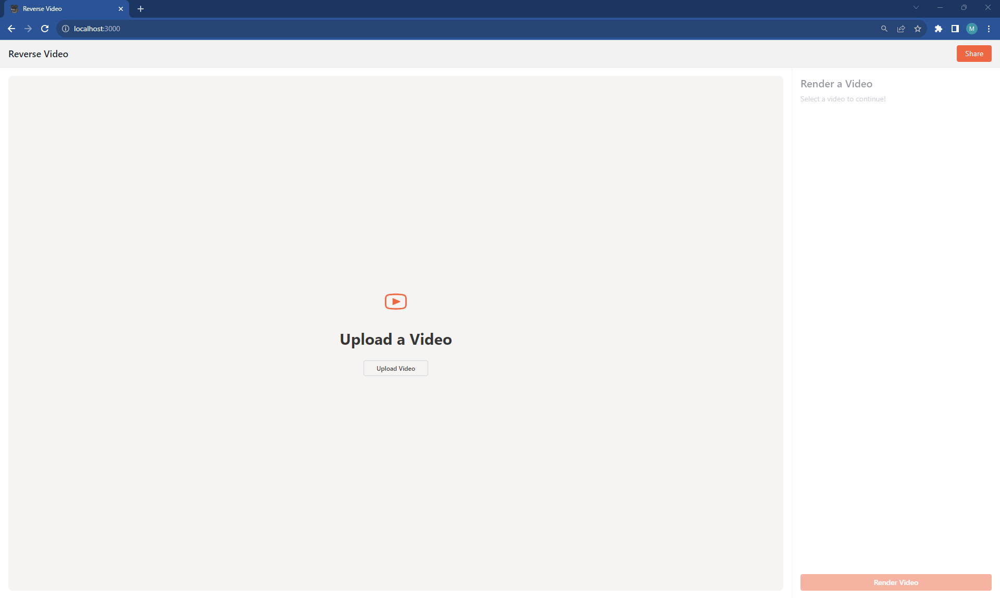

# Reverse Video
This is a web application that allows you to reverse any video. A video that is 10 seconds will remain 10 seconds but all scenes and audio will be played in reverse. I built this project to better understand wasm from an application perspective. 



Built using NextJS, Tailwind, and FFmpeg WASM. 

## Development 
```bash
npm installl && npm run dev
```

## Production

```bash
npm install && npm run build && npm run start
```

## License
All code is under an MIT License.